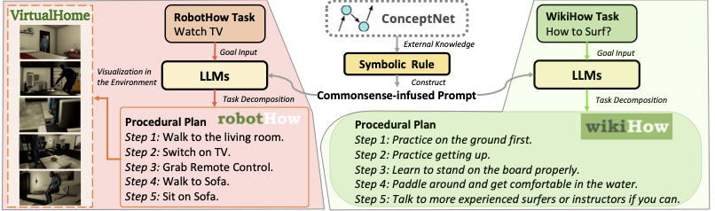
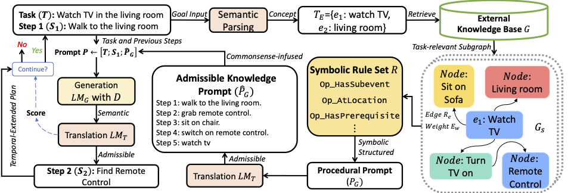

# Neuro-Symbolic Causal Procedural Planning with Commonsense Prompting

This is the official repor for our paper titled "Neuro-Symbolic Causal Procedural Planning with Commonsense Prompting", which is accepted to ICLR 2023.

## Overview
Two independant procedural planning task examples from RobotHow and WikiHow. PLAN construct commonsense-infused prompt from external knowledge (e.g., ConceptNet) to elicit procedural planning ability of the Large Language Models (LLMs) without training or exemplars.
</img>

Our five-stage pipeline includes: 1) semantically parsing the task T into concept set TE to retrieve subgraph Gs from the external knowledge base G. 2) formalize procedural prompt PG and then translate into the admissible one PˆG. 3) aggregate task, previous steps and PG as final commonsense-infused prompt P. (Section 3.1) 4) and 5) generating and translating time-extended procedural plan until triggering the termination condition. (Section 3.2)
</img>

## Install
Install the packages:
```
conda env create -f environment.yml
conda activate clap
```

## Procedural Planning
To run procedural planning on RobotHow and WikiHow:
```
python clap/clap_pp_demo.py --language_model_type gpt3 --model_type concept_knowledge --data_type robothow --max_tokens 250 --api_key YOUR_OPENAI_APIKEY
python clap/clap_pp_demo.py --language_model_type gpt3 --model_type concept_knowledge --data_type wikihow --max_tokens 250 --api_key YOUR_OPENAI_APIKEY
```

## Citations
If you find our repo useful, please cite this paper:
```bibtex
@misc{lu2023neurosymbolic,
      title={Neuro-Symbolic Procedural Planning with Commonsense Prompting}, 
      author={Yujie Lu and Weixi Feng and Wanrong Zhu and Wenda Xu and Xin Eric Wang and Miguel Eckstein and William Yang Wang},
      year={2023},
      eprint={2206.02928},
      archivePrefix={arXiv},
      primaryClass={cs.CL}
}
```